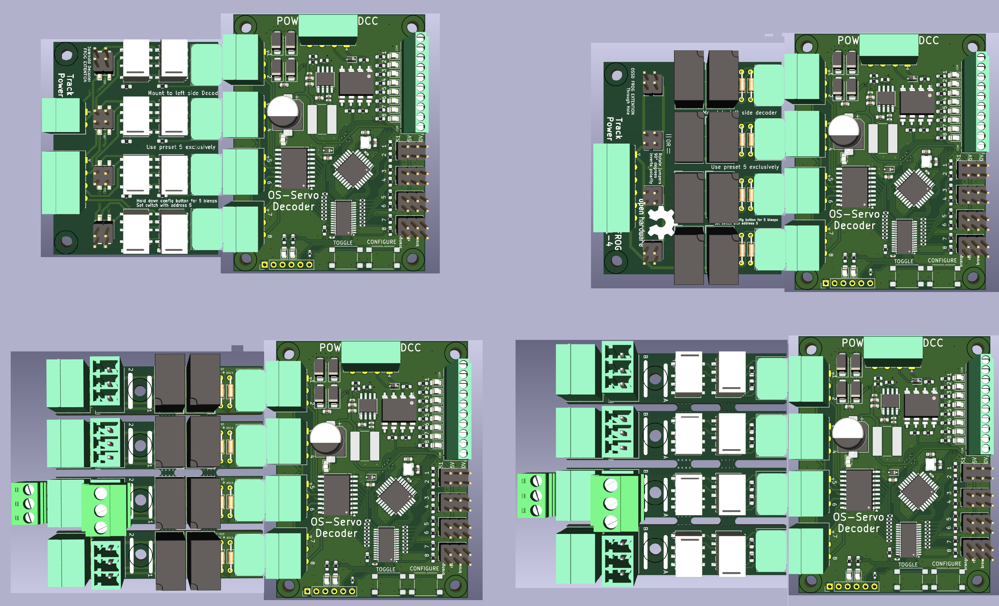

> 🌐 &nbsp; [🇬🇧 EN](Manual-EN.md) &nbsp;|&nbsp; [🇩🇪 DE](Manual-DE.md) &nbsp;|&nbsp; [🇫🇷 FR](Manual-FR.md) &nbsp;|&nbsp; [🇳🇱 NL](Manual-NL.md) &nbsp;|&nbsp; [🇪🇸 ES](Manual-ES.md) &nbsp;|&nbsp; [🇮🇹 IT](Manual-IT.md) &nbsp;|&nbsp; [🇵🇱 PL](Manual-PL.md) &nbsp;|&nbsp; 🇨🇿 CS &nbsp;|&nbsp; [🇩🇰 DA](Manual-DA.md) &nbsp;|&nbsp; [🇳🇴 NO](Manual-NO.md) &nbsp;|&nbsp; [🇸🇪 SV](Manual-SV.md) &nbsp;|&nbsp; [🇭🇺 HU](Manual-HU.md) &nbsp;|&nbsp; [🇵🇹 PT](Manual-PT.md)

# Manuál dekodérů OS-Servo

## 📘 Úvod
OS-Servo-Decoder je jednoduchý a robustní DCC příslušenský dekodér navržený pro pohon až 8 servomotorů. Podporuje moderní modelové železnice s flexibilními možnostmi konfigurace, externími relé moduly pro přepínání polarity (volitelné) a přímé ovládání pomocí vstupních přepínačů, DCC příslušenských příkazů i lokomotivních funkcí (F1–F8).

---

## 📚 Obsah

- [Manuál dekodérů OS-Servo](#manuál-dekodérů-os-servo)
  - [📘 Úvod](#-úvod)
  - [📚 Obsah](#-obsah)
  - [🔧 Vlastnosti](#-vlastnosti)
  - [🔌 Připojení dekodéru](#-připojení-dekodéru)
  - [💪 Ovládání výstupů servo](#-ovládání-výstupů-servo)
  - [🛠️ Konfigurační režim DCC](#️-konfigurační-režim-dcc)
  - [🛠️ Konfigurační režim tlačítek](#️-konfigurační-režim-tlačítek)
  - [🌟 Ukládání poloh serva](#-ukládání-poloh-serva)
  - [🚗 Režimy lokomotivních funkcí](#-režimy-lokomotivních-funkcí)
  - [⚖️ Adresový offset](#️-adresový-offset)
  - [⏰ Režim automatického přepínání](#-režim-automatického-přepínání)
  - [📊 Souhrn](#-souhrn)

---

## 🔧 Vlastnosti
- Ovládá až 8 serv  
- Používá zásuvné šroubové svorky pro snadné zapojení  
- Externí relé moduly  
- Plná podpora:  
  - Standardní pohyb výhybky  
  - Přepínání polarity (kde je podporováno)  
  - Nastavitelné krajní polohy serva (pomocí tlačítek)  
- Samostatná konfigurace: není potřeba PC, CV ani programátor  
- Volitelné ovládání lokomotivními funkcemi DCC (F1–F18)  
- Podporuje Roco 4-adresový offset  

---

## 🔌 Připojení dekodéru

*OS-Servo-Decoder-8 zobrazený s různými zapojenými rozšiřujícími relé moduly (vlevo nahoře: aretační relé; vpravo nahoře: víceúčelová relé; dole: kombinace s připojenými servy).*

OS-Servo-Decoder-8 používá stejné schéma zapojení jako OS-Solenoid-Decoder:

- **Horní záhlaví (POW / DCC):** Připojte kolejové napětí DCC nebo DC napájení (max. 19 V)
- ⚠️ **Důležité:** Nepoužívejte AC napětí — poškodí dekodér
- **Záhlaví pro serva (pravá strana):** Připojte každý servomotor ke 3-pinovému konektoru
  - Standardní zapojení: **GND — +5 V — Signál**
- **Relé konektory (levá strana):** A, COM, B — pro rozšiřující OS relé moduly

---

## 💪 Ovládání výstupů servo

Každý výstup serva je řízen DCC příslušenskou adresou. Když dekodér přijme DCC příkaz pro přiřazenou adresu, plynule posune servo do uložené polohy pro daný stav příkazu (PŘÍMÝ nebo OBLOUK).

- Odeslání příkazu **PŘÍMÝ** přesune servo do uložené přímé krajní polohy.
- Odeslání příkazu **OBLOUK** přesune servo do uložené obloukové krajní polohy.
- Pokud jsou namontovány rozšiřující relé moduly, kontakty relé se přepínají synchronně se servem pro polarizaci srdcovky.

Krajní polohy serva se ukládají pomocí funkčních kláves lokomotivy — viz [Ukládání poloh serva](#-ukládání-poloh-serva) níže.

---

## 🛠️ Konfigurační režim DCC

Dekodér podporuje konfigurační režim, který funguje zcela z vašeho DCC ovladače — není potřeba počítač ani programátor CV.

Pro vstup do konfiguračního režimu vyberte na ovladači adresu lokomotivy **9999** a nastavte **F0, F1 a F2 vše na VYPNUTO**. Dekodér vstoupí do konfiguračního režimu a přijme příkazy funkčních kláves.

Po vstupu do konfiguračního režimu použijte funkční klávesy (F1–F8) pro nastavení možností popsaných v níže uvedených sekcích. Stiskněte **F0 = VYPNUTO** pro ukončení a návrat do normálního provozu.

---

## 🛠️ Konfigurační režim tlačítek

Deska má dvě fyzická tlačítka: **CONFIGURE** (KONFIGUROVAT) a **TOGGLE** (PŘEPNOUT).

- **CONFIGURE** — přímo vstoupí do konfiguračního režimu bez potřeby ovladače. Dekodér reaguje LED signalizací indikující aktivní nastavení.
- **TOGGLE** — ručně přepne aktuálně vybraný výstup serva mezi jeho dvěma uloženými polohami. Užitečné pro testování pohybu a nastavení krajních poloh.

---

## 🌟 Ukládání poloh serva
V provozním režimu použijte tyto funkce k programování:

- **F1 = ZAP ➔** Uloží aktuální polohu jako *OBLOUK*  
- **F2 = ZAP ➔** Uloží aktuální polohu jako *PŘÍMÝ*  
- **F3 = ZAP ➔** Invertuje relé srdcovky *(pouze model s 6 relé)*  
- **F0 = VYP ➔** Ukončí provozní režim  

---

## 🚗 Režimy lokomotivních funkcí
V konfiguračním režimu můžete zvolit ovládání dekodéru pomocí lokomotivních funkčních kláves místo příslušenských příkazů.

- **F4 = ZAP ➔** Zakáže ovládání lokomotivou *(výchozí)*  
- **F5 = ZAP ➔** Povolí režim lokomotivních funkcí *(F1–F8)* — používá 1 adresu  
- **F6 = ZAP ➔** Povolí 4-funkční režim *(F1–F4)* — používá 2 adresy  

To umožňuje velmi rychlé přepínání pomocí ovladačů jako Roco Lokmaus nebo Multimaus.

---

## ⚖️ Adresový offset
Pro kompenzaci offsetu Roco o 4 použijte:

- **F7 = ZAP ➔** Povolí 4-adresový offset  

---

## ⏰ Režim automatického přepínání
Povolte automatické přepínání vybraného motoru:

- **F8 = ZAP ➔** Motor se přepíná každých 5 sekund  
  - Rychlost je řízena ovladačem  
  - Směr ovladače nehraje roli  
  - Ovladač 0 = pomalu, Maximum = rychle  

V tomto režimu motor již není řízen funkčními klávesami ovladače.

---

## 📊 Souhrn
- Použijte tlačítka pro přímé nastavení a nastavení serva  
- Použijte DCC adresu lokomotivy **9999** s **F0, F1, F2 VYPNUTO** pro vstup do konfiguračního režimu  
- Použijte **F1/F2** pro uložení poloh serva  
- Použijte **F4–F8** pro povolení ovládání lokomotivními funkcemi, adresového offsetu nebo režimů přepínání  

Všechny OS-Servo-Decoders sdílejí toto rozhraní a logiku.  
Není potřeba počítač. Žádné CV. Stačí zapojit, adresovat a spustit.
